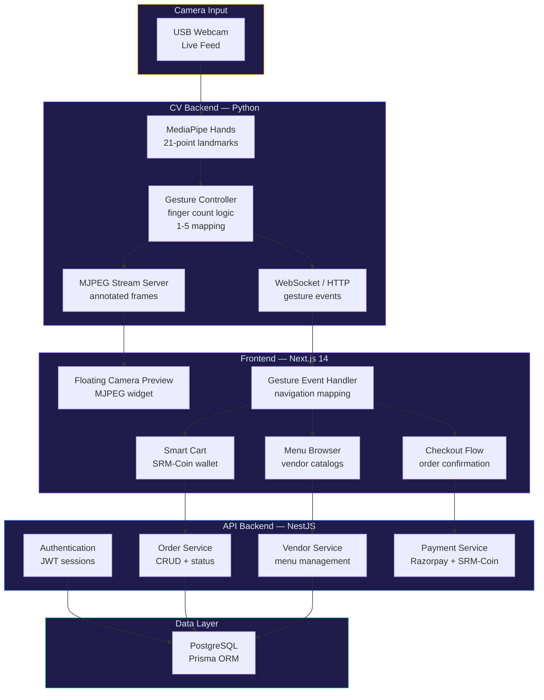

<div align="center">

# Order@Ease — Touchless Campus Food Kiosk

**Gesture-controlled food ordering kiosk with real-time sign language detection, MJPEG camera preview, and zero-touch checkout — built for SRM University**


<br/>

**[→ Live Demo](https://orderatease.vercel.app)**

</div>

---

## The Problem

Traditional food ordering kiosks in university campuses require physical touchscreen interaction — a hygiene concern amplified post-pandemic, and a significant accessibility barrier for students with motor impairments or hearing disabilities. There's no commercially available kiosk system that allows students to browse menus, select items, and complete checkout entirely through hand gestures and sign language.

Order@Ease replaces touch with vision. A Python-based CV backend processes hand gestures in real-time via MediaPipe, streaming control signals to a premium Next.js frontend. Students use 1–5 finger counts to navigate, select, scroll, and confirm — while a floating MJPEG camera preview shows their gesture feedback live in the browser.

---

## What This Does

A full-stack campus food ordering platform with two interaction modes — gesture-controlled and traditional touch — unified under a single premium UI.

- **Touchless navigation** — 1–5 finger gesture mapping for menu browsing, item selection, scrolling, and cart operations
- **Real-time sign language detection** — MediaPipe hand landmark extraction with finger count classification running at 30 fps
- **Live camera preview** — MJPEG stream embedded as a floating widget in the web UI, showing the student their own gesture feedback
- **Premium dark-mode UI** — inspired by leading food delivery apps with smooth animations and glassmorphism cards
- **Smart Cart & Wallet** — SRM-Coin campus currency ecosystem with simulated payment flow
- **Multi-vendor support** — multiple campus food vendors with unified single-checkout experience

---

## System Architecture



---

## Tech Stack

| Layer | Technology | Role |
|:---|:---|:---|
| **CV Backend** | Python 3.9+, OpenCV, MediaPipe | Hand tracking, finger count, gesture classification |
| **Stream Server** | Flask / MJPEG | Annotated camera frame streaming to browser |
| **Frontend** | Next.js 14, TypeScript, React | Menu UI, cart, checkout, gesture event handler |
| **Styling** | Tailwind CSS, CSS Modules | Dark-mode-first premium design system |
| **API Backend** | NestJS, Prisma | REST API for orders, vendors, authentication |
| **Database** | PostgreSQL | Persistent storage for orders, menus, users |
| **Payments** | Razorpay SDK + SRM-Coin | Real and simulated campus payment integration |
| **Mobile** | Flutter (Dart) | Android scaffold for mobile ordering |
| **Deployment** | Vercel | Frontend edge deployment |

---

## Gesture Mapping

| Fingers Shown | Action |
|:---|:---|
| ☝️ **1 finger** | Scroll up / Previous item |
| ✌️ **2 fingers** | Scroll down / Next item |
| 🤟 **3 fingers** | Select / Add to cart |
| 🖖 **4 fingers** | Remove / Go back |
| 🖐️ **5 fingers** | Confirm / Proceed to checkout |
| ✊ **Fist** | Cancel / Close menu |

---

## Getting Started

### Prerequisites
- Python 3.9+ (for CV backend)
- Node.js 18+ (for frontend and API)
- PostgreSQL (local or Docker)
- USB webcam

### Quick Start

```bash
# Clone the repository
git clone https://github.com/Hazz-Y/OrderAtEase-Touchless-Campus-Kiosk.git
cd OrderAtEase-Touchless-Campus-Kiosk

# 1. Start the CV backend
pip install opencv-python mediapipe flask
python cv_backend.py
# → Camera opens, gesture detection starts
# → MJPEG stream at http://localhost:5001/video_feed

# 2. Start the frontend (new terminal)
cd veats-campus/frontend
npm install
npm run dev
# → http://localhost:3001

# 3. Start the API backend (new terminal)
cd veats-campus/backend
npm install
npx prisma migrate dev --name init
npm run start:dev
# → http://localhost:3000
```

---

## Project Structure

```
OrderAtEase-Touchless-Campus-Kiosk/
├── cv_backend.py                # Gesture detection server (OpenCV + MediaPipe)
├── gesture_controller.py        # Hand tracking & finger count logic
├── server.js                    # Razorpay payment server (legacy)
├── veats-campus/
│   ├── frontend/                # Next.js 14 UI (TypeScript)
│   │   ├── components/          # Menu, cart, camera preview, gesture handler
│   │   ├── pages/               # Route views
│   │   └── styles/              # Dark-mode design system
│   ├── backend/                 # NestJS API
│   │   ├── src/
│   │   │   ├── orders/          # Order CRUD + status tracking
│   │   │   ├── vendors/         # Menu management
│   │   │   ├── auth/            # JWT authentication
│   │   │   └── payments/        # Payment processing
│   │   └── prisma/              # Schema + migrations
│   └── mobile/                  # Flutter Android app
└── README.md
```

---

## Contributors

- [Hazz-Y](https://github.com/Hazz-Y)
- [SamriddhiGanguly05](https://github.com/SamriddhiGanguly05)

---

## License

MIT — see [LICENSE](LICENSE) for details.
